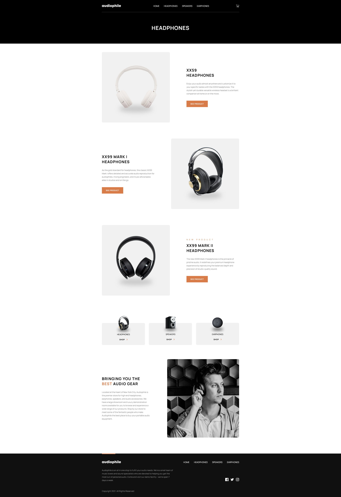
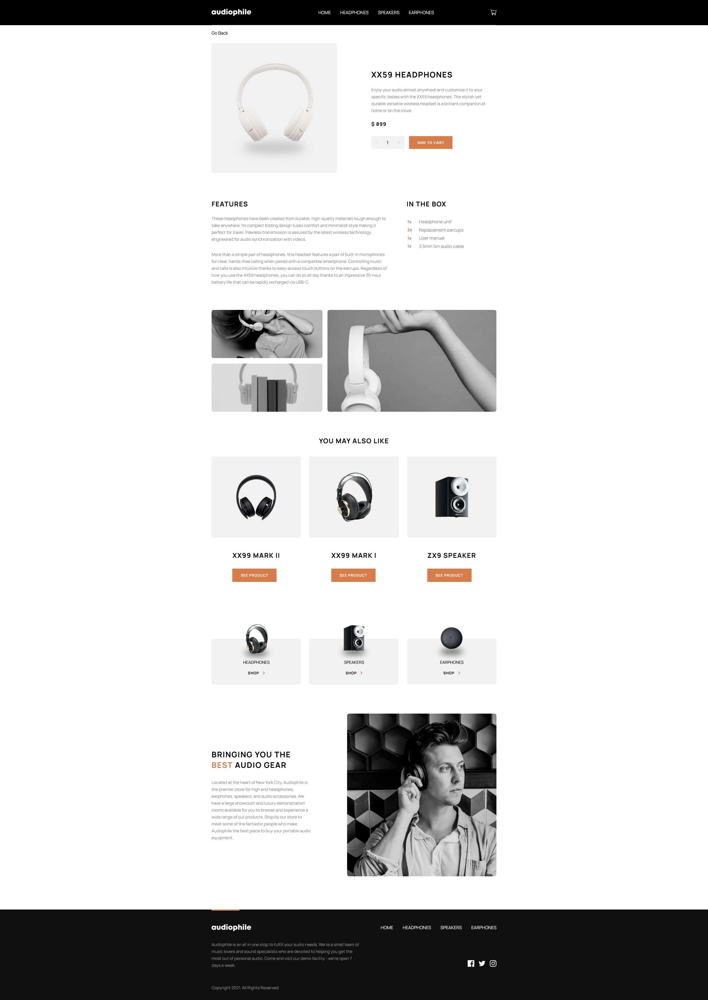
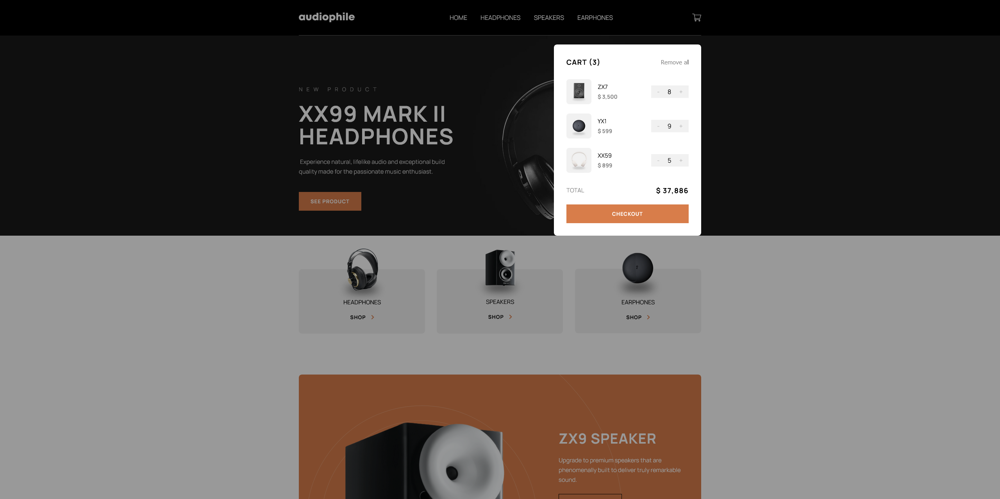
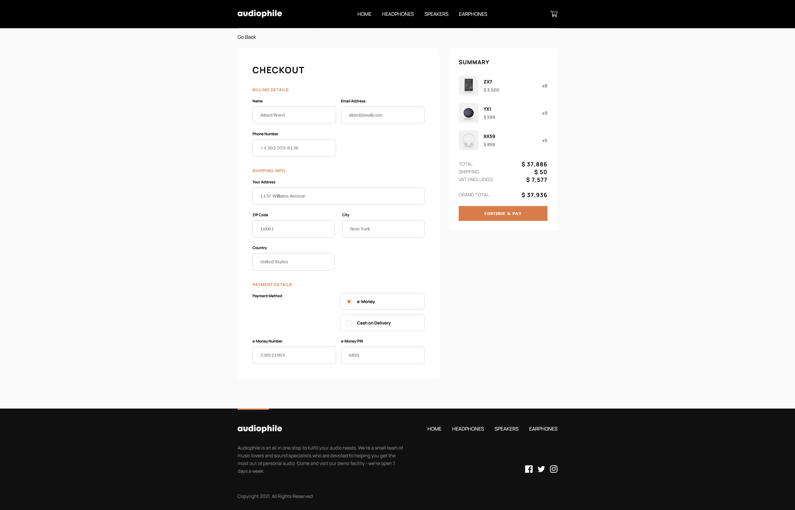
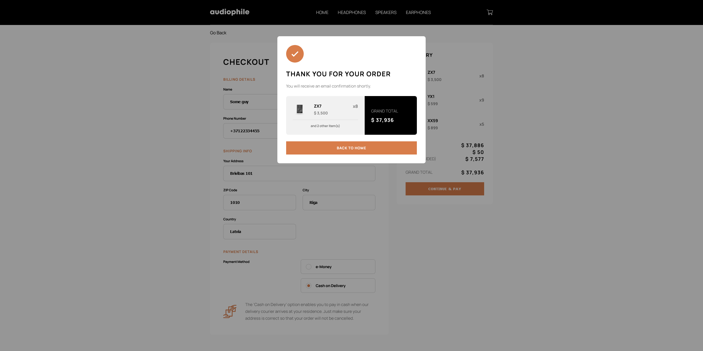

# Frontend Mentor - Audiophile e-commerce website solution

This is a solution to the [Audiophile e-commerce website challenge on Frontend Mentor](https://www.frontendmentor.io/challenges/audiophile-ecommerce-website-C8cuSd_wx).

## Table of contents

- [Overview](#overview)
  - [The challenge](#the-challenge)
  - [Screenshot](#screenshot)
  - [Links](#links)
- [My process](#my-process)
  - [Built with](#built-with)
  - [What I learned](#what-i-learned)
  - [Continued development](#continued-development)
  - [Useful resources](#useful-resources)
- [Author](#author)

## Overview

### The challenge

Users should be able to:

- View the optimal layout for the app depending on their device's screen size
- See hover states for all interactive elements on the page
- Add/Remove products from the cart
- Edit product quantities in the cart
- Fill in all fields in the checkout
- Receive form validations if fields are missed or incorrect during checkout
- See correct checkout totals depending on the products in the cart
  - Shipping always adds $50 to the order
  - VAT is calculated as 20% of the product total, excluding shipping
- See an order confirmation modal after checking out with an order summary
- Keep track of what's in the cart, even after refreshing the browser (`localStorage` could be used for this if you're not building out a full-stack app)

### Screenshot

### Links

- Solution URL: [https://github.com/GFJankavs/vue-audiophile-ecommerce](https://github.com/GFJankavs/vue-audiophile-ecommerce)
- Live Site URL: [https://gfjankavs.github.io/vue-audiophile-ecommerce/](https://gfjankavs.github.io/vue-audiophile-ecommerce/)

## My process

### Built with

- Semantic HTML5 markup
- CSS custom properties
- Flexbox
- CSS Grid
- Mobile-first workflow
- [Vue 3](https://reactjs.org/) - Progressive JavaScript Framework
- [Vue Router](https://router.vuejs.org/) - Expressive, configurable and convenient routing for Vue.js
- [Pinia](https://pinia.vuejs.org/) - global state management library for Vue
- [VueUse](https://vueuse.org/) - Collection of Essential Vue Composition Utilities
- [Vue Toastification](https://github.com/Maronato/vue-toastification) - Toast notifications for Vue
- [email-validator](https://github.com/manishsaraan/email-validator) - JS module to validate an e-mail address
- [libphonenumber-js](https://www.npmjs.com/package/libphonenumber-js) -

### What I learned

This was my second project that I had made with VueJS in some time. This was a bigger project than the previous one because here I had to also use routing and global state management that needs to be shared between multiple views. Although I have been acustomed to syntax for this framework, this project was great practice for becoming more proficient in VueJS.

I learned how to use VueJS native components `<Teleport/>` and `<Transition/>` which are not common in React. The closest of either of these two things that I had worked with similarly is React Portal (similar to `<Teleport/>`). I had a chance to use both Options API and Composition API when creating components for this project. I saw pros and cons when using them both which provided a better understanding when and how to use both of these approaches.

I was working a lot with CSS Grid in this project. What I learned was about `grid-template-areas` and `grid-areas` properties as they were quite useful when creating such grid that I needed. It was something that I had read and learned prior to this project but not yet put to practice so extensively.

I remember my mentors telling me that developers should have "mobile-first" mindset when developing components/website. While working on this project, I realised how difficult it would have been if I did it the other way around as this mindset allows you to add more code and remove less much easier and helps you prepare for unexpected hurdles during development.

### Continued development

There is a list of things that I could do to improve this project:

- **Project structure** - So far all the components are in a folder called `components`. There is no distinction between shared and specialised components within this folder. I could restructure it as to provide more clarity on how these components are used.
- **Implementation of slots** - When initially working on this project I had thought of using `<slot/>` to improve general usage of components. Knowing all the components use cases and how they are going to be utilised stopped me from investing more time in creating such components, it would be a good practice to modify them as such components are more useful in large projects with hundreds of components.
- **Additional form autocomplete features** - So far only when selecting country the user is provided with autocomplete feature. This feature could be extended also for other inputs like `address` and `city`. Additionaly, there could be some more validation added for other inputs ,like, `e-Money Number`.
- **Cleanup on CSS** - I have noticed that there are some CSS styles that have same implementation but under different classes. This styling could be turned into general usage classes or even turned into components that can be reusable.

### Useful resources

- [Reusable modal component in Vue](https://itnext.io/how-to-build-a-reusable-modal-component-in-vuejs-f1799ab9b3e) - This article helped to create a reusable modal for any kind of component I need. It would have been a bigger struggle without it.
- [Vue Toastification + Vue Router](https://github.com/Maronato/vue-toastification/issues/162) - There was an issue where for some reason Vue Toastification would not work properly if `<RouterLink/>` was within a toast notification. This article helped solve this issue.
- [Custom Autocomplete input](https://www.digitalocean.com/community/tutorials/vuejs-vue-autocomplete-component) - I wanted to have autocomplete for country input as based on this input would rely validation for phone number. The creation process is well documented and explained.

## Author

- Website - [GFJankavs](https://www.gfjankavs.lv)
- Frontend Mentor - [@yourusername](https://www.frontendmentor.io/profile/GFJankavs)
- LinkedIn - [Gustavs Fricis Jankavs](https://www.linkedin.com/in/gustavs-fricis-jankavs/)
